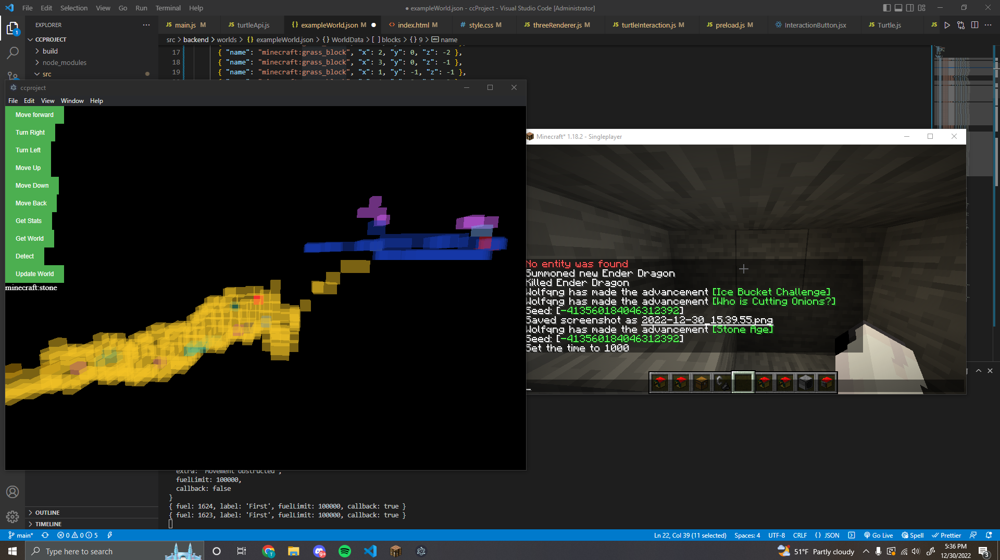
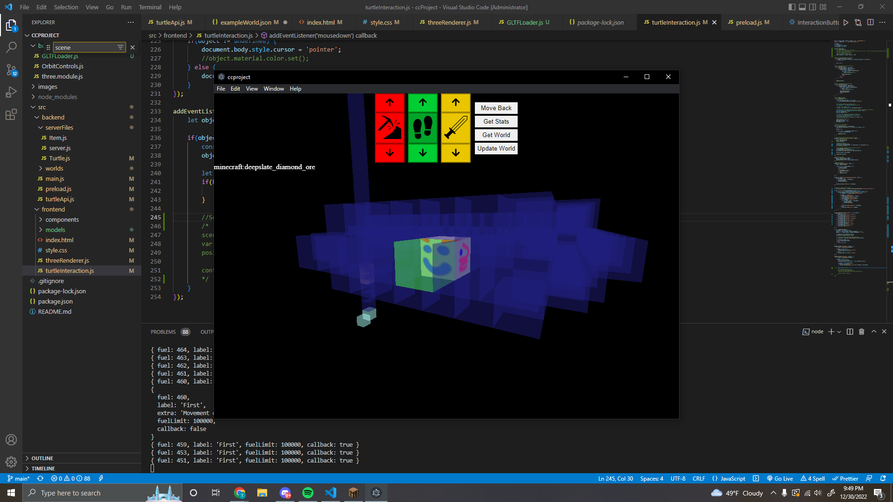

# Turtle program
## Overview
A desktop application based on the Electron framework using Three.js and WebSocket to execute. Uses data from clients to visualize and interact with a game.

## Inspired by
https://www.youtube.com/watch?v=pwKRbsDbxqc&t=1682s

## Turtle setup
Paste this as startup\
https://pastebin.com/SYnheFxj

## ToDo
### Basics
-Make the interaction between front-end and back-end more understandable\
-Clean up front-end code\
-More comments\
-Inventory system\
-Better controls\
-Error handling

### Advanced
-Replication\
-Crafting\
-Mining AI\
-Hive AI

### Extra
-Textures\
-Rotation offset\
-Other peripherals\
-Farming

## Screenshots

