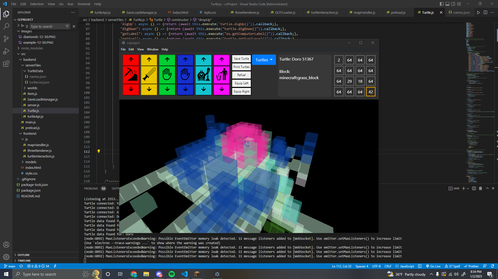
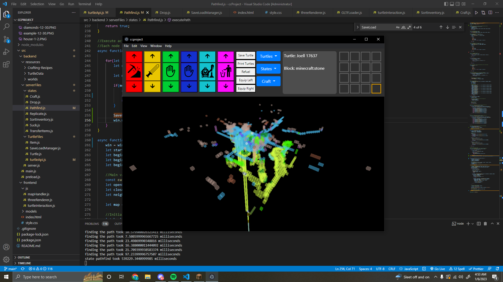

# Turtle program
## Overview
A desktop application based on the Electron framework using Three.js as the renderer and WebSocket to communicate. Uses data from clients to visualize and interact with a game. Using an AI system the turtles can do complex tasks.

## Inspired by
https://www.youtube.com/watch?v=pwKRbsDbxqc&t=1682s

## Environment setup
### Node Modules
electron\
electron-prompt\
ws\
three

## Turtle setup
Paste this as startup\
pastebin get maY5fQmM startup\
https://pastebin.com/maY5fQmM

## Features
-Crafting\
-Replication\
-Remote control\
-Inventory sorting\
-Inventory management\
-Saving and Loading\
-Visualization\
-Pathfinding

## ToDo
### Basics
-Error handling

### Advanced
-Furnace usage\
-Building blueprints\
-Mining\
-Tree farming\
-Hive AI

### Extra
-Textures\
-Rotation offset\
-Other peripherals\
-Farming

## AI Idea
This is crazy but heres the plan
https://docs.google.com/document/d/1a4ert9upmV6r99dBzyar_n_ZdZ_TYz9vZFOH0HqIWp4/edit?usp=sharing

## Screenshots

