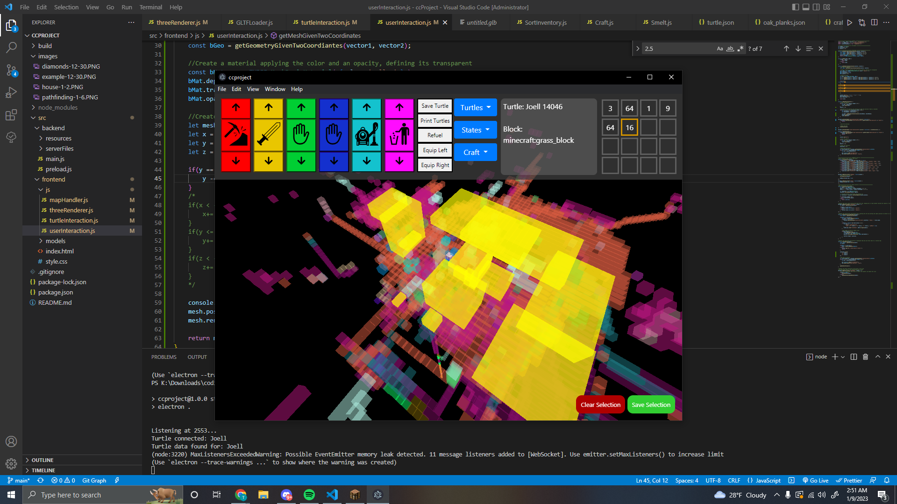

# Turtle program
## Overview
A desktop application based on the Electron framework using Three.js as the renderer and WebSocket to communicate. Uses data from clients to visualize and interact with a game. Using an AI system the turtles can do complex tasks.

## Inspired by
https://www.youtube.com/watch?v=pwKRbsDbxqc&t=1682s

## Environment setup
### Node Modules
electron\
electron-prompt\
ws\
three

## Turtle setup
Paste this as startup\
pastebin get DGZejmGJ startup\
https://pastebin.com/DGZejmGJ

## Problems
As far as I know in the Fabric Version 1.100.8 interaction with the outputs of furnaces are not working with turtles so as of recent I am now developing on Forge 1.19.2

## Features
-Crafting\
-Replication\
-Remote control\
-Inventory sorting\
-Inventory management\
-Saving and Loading\
-Visualization\
-Pathfinding\
-Building blueprints

## ToDo
### Always
-CLEAN THE CODE - Removing unecessary functions, weird variable and function names, no returns, parameters, shared code\
-Split up the functions into more files, make variables shared between files accessible in a better manner\
-Lower the amount of imports used\
-Split the code into more functions

### Basics
-Implement exceptions\
-Error handling\
-jsdoc\
-Go over Pathfinding, problem in there with blockPlacedByTurtle I believe

### Advanced
-Furnace usage\
-Mining\
-Tree farming\
-Hive AI\
-Make it easier for this server to not be local\
-Optimize pathfinding some more

-Multi threads(So the main thread doesn't pause on execution and allow turtles to execute fatser)\
-On WebSocket request send an id that is expected back rather than keeping a boolean to see if the turtle is busy, allows for multiple turtles to execute at once

### Extra
-Textures\
-Rotation offset\
-Other peripherals\
-Farming\
-Turtle logins\
-Redstone interaction

## AI Idea
This is crazy but heres the plan
https://docs.google.com/document/d/1a4ert9upmV6r99dBzyar_n_ZdZ_TYz9vZFOH0HqIWp4/edit?usp=sharing

## Screenshots

## The way to get started is to quit talking and begin doing. -Walt Disney
